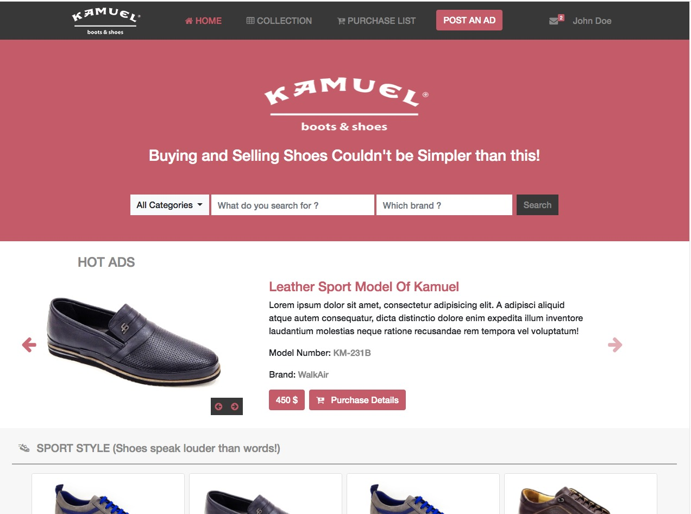
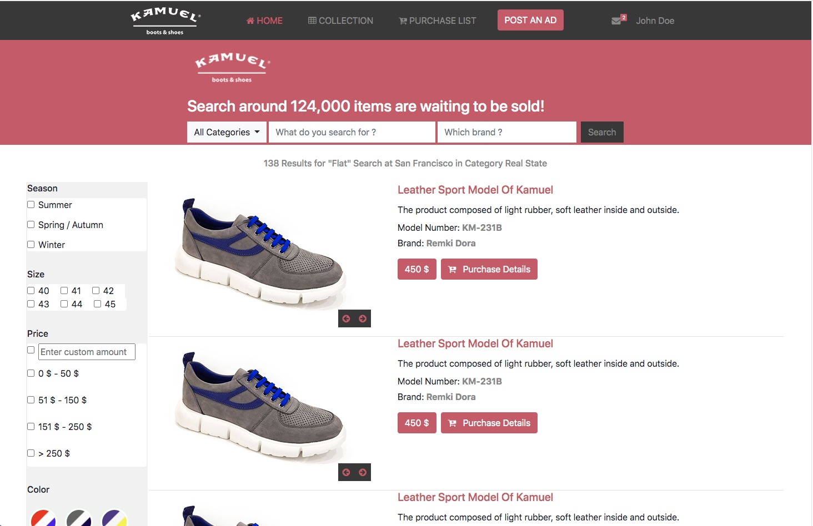
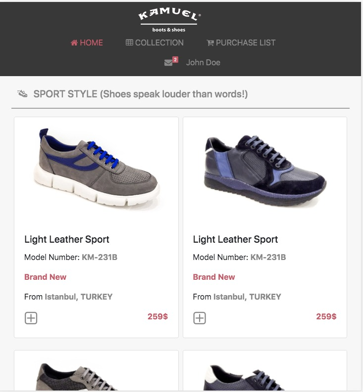
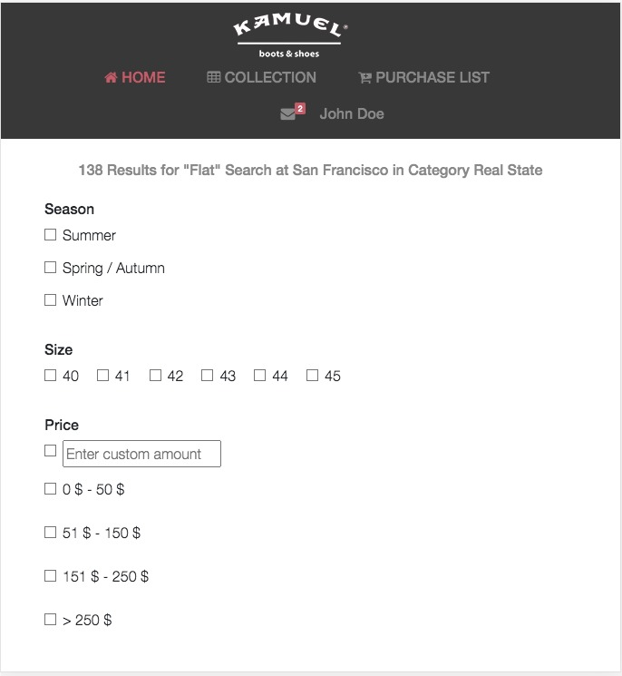

# online-shop-frontend

Microverse School > 8. HTML &amp; CSS3 > Capstone Project: Online shop frontend for footwears

# HTML-CSS-capstone-project (Online shop for footwear)

>
This is a project for the HTML & CSS capstone project: Online shop for electronics (https://www.behance.net/gallery/24796463/ZATTIX).
The Project is based on an online shop for electronics. I personalized the content, instead of a shop of electronics I built a page for the store for footwears.
I followed the best practices in HTML, CSS and in GitHub process flow.

## Desktop Screenshots (tablet & desktop: size from 768px)

#### Main page

#### Search result page

## Small screen Screenshots (mobile: size up to 768px)

#### Main page

#### Search result page

## Built With

- HTML
- CSS
- Flex layout
- Bootstrap 4.5.0 framework
- Font Awesome 4.7.0 icons
- Flaticon Icons

## Requirements
- Use semantic HTML tags.
- Use CSS selectors correctly.
- Use HTML elements box model (margin, padding, width, height).
- Use industry-standard tools (flexbox) to place elements in the page.
- Ability to create UIs adaptable to different screen sizes using mediaqueries.
- Apply front-end best practices.

## Live Demo

[Live Demo Link Home page](https://raminmammadzada.github.io/online-shop-frontend/)

[Live Demo Link Search Result page](https://raminmammadzada.github.io/online-shop-frontend/search_result.html)

### Prerequisites

- Browser (Google Chrome, Mozilla Firefox, Safari or any other browser)

### Setup

- Download or clone the repository's files
- Open the index.html file using any web browser of your choice
- Additionally, You can go to [githack](https://raw.githack.com) and put the link of HTML file there and access the site from generated link.

## Author

👤 **Ramin Mammadzada**

- Github: [@RaminMammadzada](https://github.com/RaminMammadzada)
- Twitter: [@RaminMammadzada](https://twitter.com/RaminMammadzada)
- Linkedin: [@RaminMammadzada](https://www.linkedin.com/in/raminmammadzada)

## 🤝 Contributing

Contributions, issues and feature requests are welcome!

Feel free to check the [issues page](https://github.com/RaminMammadzada/online-shop-frontend/issues).

## Show your support

Give a ⭐️ if you like this project!

## Acknowledgments

- Microverse
- GitHub
- Bootstrap
- [Mohammed Awad](https://www.behance.net/M_Awad) for the design guide.
- [Fundacion adopta no compres](https://www.adoptanocompres.org/web/) for the inspiration.
- [pixabay.com](https://pixabay.com/) for the free images of pets.

## 📝 License

This project is [MIT](lic.url) licensed.
